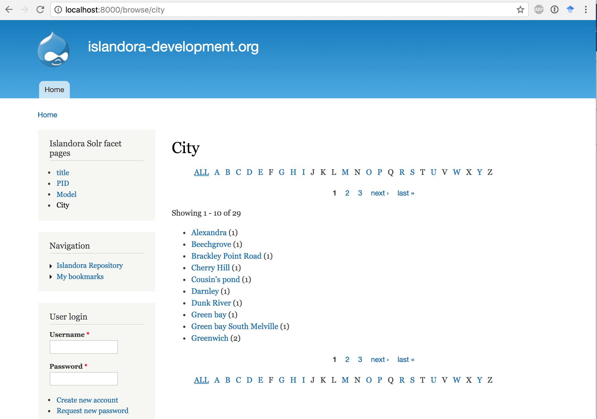

# Islandora Solr Facet Pages [](https://travis-ci.org/Islandora/islandora_solr_facet_pages)

## Introduction

Islandora Solr Facet Pages provides alphabetical "A to Z" browse lists from metadata indexed in Solr. You can set up multiple A-to-Z browse lists from different facets (Solr fields). For example, this can be used to list all authors or all subject headings present in an Islandora repository.

Each facet page appears at _/browse/my-configured-path_.


## Requirements

This module requires the following modules/libraries:

* [Islandora](https://github.com/islandora/islandora)
* [Tuque](https://github.com/islandora/tuque)
* [Islandora Solr](https://github.com/Islandora/islandora_solr_search)

## Installation

Install as usual, see [this](https://drupal.org/documentation/install/modules-themes/modules-7) for further information.

## Configuration

Configure facet pages at Administration » Islandora » Solr index » Facet Pages (_/admin/islandora/search/islandora_solr/facet_pages_).



### Facet Pages

Each facet page requires a solr field (the facet) and a path (so the page will be at _/browse/{path}_). The label, if present, is set as the Drupal page title.

When choosing Solr fields for facets, you probably want to select _string_ fields. This depends on your Solr config, but often this includes fields ending in \*_s or \*_ms. Strings  will display as full multi-word phrases. Text fields (often \*_mt or the dc.* fields) will show raw parsed text (individual words or parts of words) and is usually not what is desired.

If you need to configure more pages than the form provides, save the full configuration form and more blank fields will automatically appear.

### Results per page

When the list of facets is long, it can be split over multiple pages using a pager. This variable sets the page size.

### Maximum facet values

Set the maximum number of facet values to return, period. If this value is less than the number of values that exist in Solr, they will be pruned arbitrarily. However, lowering this value may improve page loading speeds.

### Facet search form

Provide the user with a search form to search within these facets.

Search is case-sensitive and must match the entire facet value. Therefore, search does not work well on string fields, unless the user makes use of wildcards. For example, `*Alice*` would  match that term anywhere within the string, while `Alice` would only match a full string value of "Alice".

This search form works more intuitively on text (e.g. *_mt) facets, but as mentioned above, raw tokenized values are generally _not_ what is desired for display.


## Notes

### Islandora Solr Facet Pages block

This module provides a block named "Islandora Solr facet pages" that can be configured in Block settings (Administration » Structure » Blocks). It contains a list of links to all configured facet pages.

### Theming the Facet Pages

This module provides template files for the entire page (islandora-solr-facet-pages-wrapper.tpl.php) and the results list (islandora-solr-facet-pages-results.tpl.php). The alphabetical pager uses a theme function.

Template files can be overridden by a theme by copying the template file from the modules folder into the theme folder. You can override a theme per defined facet page by appending the path value to the template file. If you do, make sure to copy the original template file to your theme as well.

The folder for a theme that customizes the Solr facet pages layout would look like this:
```
sites/all/themes/{your-theme-folder}
├── {other files}
├── islandora-solr-facet-pages-results.tpl.php
├── islandora-solr-facet-pages-results--{your-path}.tpl.php
└── islandora-solr-facet-pages-wrapper.tpl.php
```

## Documentation

This module's documentation is also available at [our wiki](https://wiki.duraspace.org/display/ISLANDORA/Islandora+Solr+Facet+Pages).

## Troubleshooting/Issues

Having problems or solved a problem? Check out the Islandora google groups for a solution.

* [Islandora Group](https://groups.google.com/forum/?hl=en&fromgroups#!forum/islandora)
* [Islandora Dev Group](https://groups.google.com/forum/?hl=en&fromgroups#!forum/islandora-dev)

## Maintainers/Sponsors

Current maintainers:

* [Nelson Hart](https://github.com/nhart)

## Development

If you would like to contribute to this module, please check out [CONTRIBUTING.md](CONTRIBUTING.md). In addition, we have helpful [Documentation for Developers](https://github.com/Islandora/islandora/wiki#wiki-documentation-for-developers) info, as well as our [Developers](http://islandora.ca/developers) section on the [Islandora.ca](http://islandora.ca) site.

## License

[GPLv3](http://www.gnu.org/licenses/gpl-3.0.txt)
